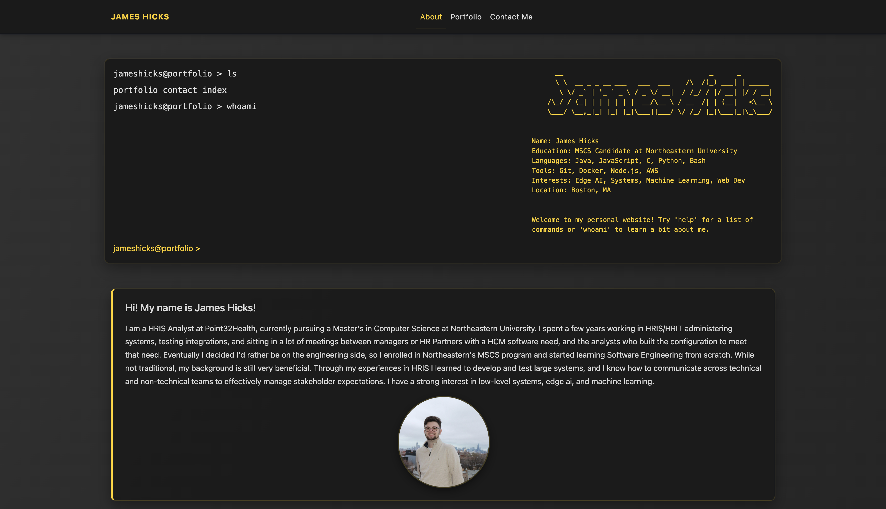
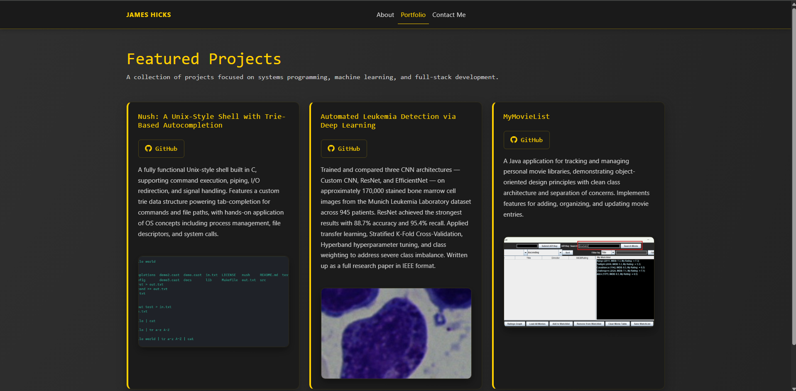
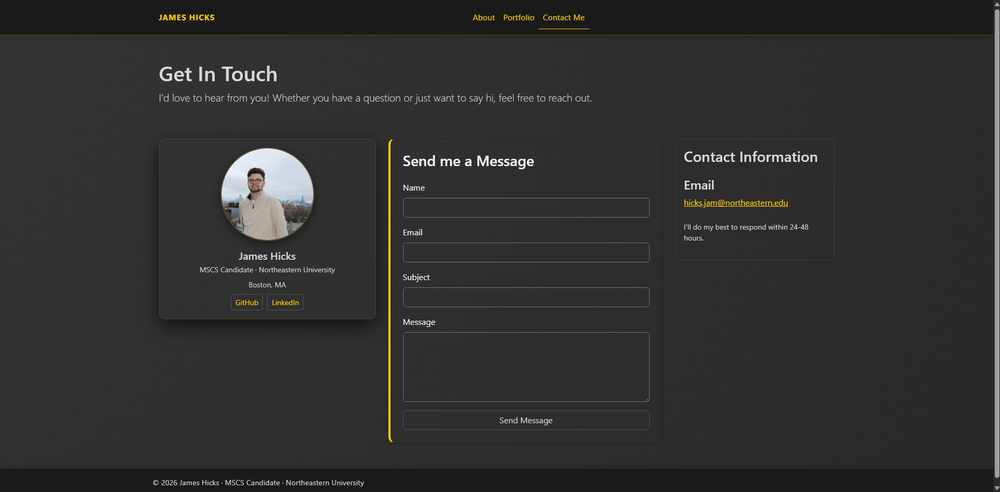

# James Hicks Portfolio Site

Terminal-inspired personal portfolio website built with HTML, CSS, JavaScript, and Bootstrap.

Live Site: https://jc-hicks.github.io/

---

## Author

James Hicks

## Class Link

https://northeastern.instructure.com/courses/249954

## Overview / Objective

This project is a responsive portfolio website designed to emulate a terminal/shell environment. Users can navigate the site using command-style interactions while exploring projects, technical skills, and personal information.

The site was developed to strengthen frontend development skills and demonstrate proficiency with:

- Responsive web design
- DOM manipulation
- Asynchronous JavaScript
- Dynamic project rendering
- GitHub Pages deployment

The site was also developed with the goal of having a one-stop-shop that is representative of me to prospective employers, or other people who may be interested in my work so far in CS. I also wanted to build something using JS, that allowed me to focus primarily on the syntax, since I had completed a project around a shell/terminal before in C, and I wanted to see how I could implement a similar concept in JS.

---

## Creative Feature

There are a few creative features on this page, but the primary creative feature is the mock terminal, which allows users to display new information, change their current page, and clear the terminal.

---

## AI Usage / AI Generated page

While the index.html page, and portfolio.html pages were written by me, contact.html was created using Copilot CLI. It did a pretty good job at completing this in one go, though there were some styling inconsistencies that needed to be fixed with a second prompt. I also had to manually change some font colors myself.

I tried to use AI sparingly throughout this project, as this is my first multi-page project using HTML/JS. I wanted to work through as much as possible on my own. I did however use AI and Codex to help me with theming/coloring my page. I essentially asked Codex to transform my initial index page from the basic Bootstrap coloring I had, to a yellow/black them.

```
Copilot CLI
Now let me check the CSS to understand the styling:

Let me check if contact.html already exists:

Read contact.html

The file exists but is empty. Let me check the about.html for additional reference:

Read about.html

Now I'll create a contact page following the same structure and styling as the existing pages:

Edited
contact.html+152-1
Perfect! I've created a professional contact page that follows the styling and structure of your existing pages. Here's what I included:

Key Features:

Same navbar structure with consistent branding and navigation links
Bootstrap 5 styling matching your other pages
Two-column layout (desktop-friendly, responsive)
Contact form with name, email, subject, and message fields
Contact information section with email, location, and social media links
Consistent visual design with card components and spacing that matches your existing pages
The page is fully responsive and will collapse to single columns on mobile devices. The navigation link for "Contact me!" is now marked as active on this page, and all other nav links properly route to their respective pages.

Claude Haiku 4.5

```

Reformatting prompt:

```
Codex

"Fix the styling for the contact page to match what is in index/portfolio. Do NOT use !important. Add the footer we have on the other pages, and make sure all text is legible."

I'll open contact.html and the CSS files to find and fix styling differences.
Read contact.html
Next I'll open index.html and the project's CSS files to compare structure and styles.
Read index.html
I'll open base.css and related CSS files to confirm color variables and footer styles.
I'll create a short TODO plan for the contact-page fixes.
Now I'll update contact.html: remove the global text-light from the main container and add the shared footer.
Now I'll append contact-specific CSS tweaks to base.css to improve contrast and match other pages.
Updating the TODO list to mark implemented changes and continue verification.
Reviewing updated contact.html and base.css to confirm edits.
Read contact.html
Confirming appended CSS in base.css.
Marking verification completed in the TODO list.
Completed: Verify changes by reviewing files (3/3)
Files updated: contact.html — removed the global text-light on the main container and added the shared footer; base.css — added scoped .contact-page rules to improve contrast and match the index/portfolio styles.
What I fixed: form labels/placeholders, muted text, input borders and button hover states for better legibility on dark background; footer now matches the other pages.
Verify / Next: Open contact.html in a browser to confirm; would you like me to run the formatter and commit these changes?

GPT-5 mini
```

---

## Features

- Terminal-inspired UI
- Dynamic project loading via JSON
- Command-line style navigation
- Responsive Bootstrap layout
- GitHub integration
- Mobile-friendly design

---

## Technologies Used

- HTML5
- CSS3
- JavaScript (ES6+)
- Bootstrap 5
- Git/GitHub Pages

---

## Screenshots

### Homepage



### Projects Section



### Contact Page


---

## Installation / Local Development

### Prerequisites

- Node.js (v14 or higher)
- npm (comes with Node.js)

### Setup

Clone the repository:

```bash
git clone https://github.com/jc-hicks/PersonalSite.git
cd PersonalSite
```

Install dependencies:

```bash
npm install
```

### Development

To start a local development server with live reload:

```bash
npm run dev
```

The site will automatically open in your default browser at `http://localhost:8080` and will reload whenever you make changes to files.

Alternatively, to start a simple HTTP server without live reload:

```bash
npm run serve
```

### Build Commands

**Format code** with Prettier:

```bash
npm run format
```

**Check code formatting** without making changes:

```bash
npm run format:check
```

**Lint code** with ESLint:

```bash
npm run lint
```

**Auto-fix linting issues**:

```bash
npm run lint:fix
```

**Validate** formatting and linting together:

```bash
npm run validate
```

### Project Structure

```
PersonalSite/
├── index.html              # Homepage with terminal UI
├── projects.html           # Portfolio projects page
├── contact.html            # Contact page
├── about.html              # About page
├── js/
│   ├── main.js            # Main entry point
│   ├── script.js          # Terminal and page interactions
│   └── projects.js        # Project rendering logic
├── css/
│   ├── base.css           # Terminal and base styles
│   ├── components.css     # Component styles
│   ├── layout.css         # Layout utilities
│   └── utilities.css      # Utility classes
├── assets/                # Images and static files
├── projects.json          # Project data
└── package.json           # Project configuration
```
