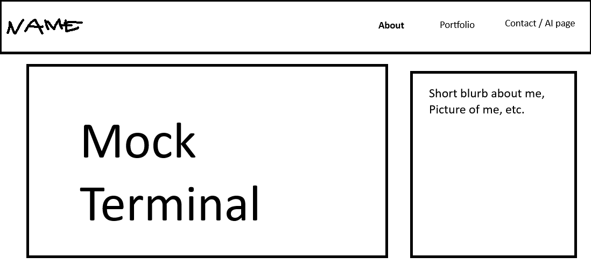
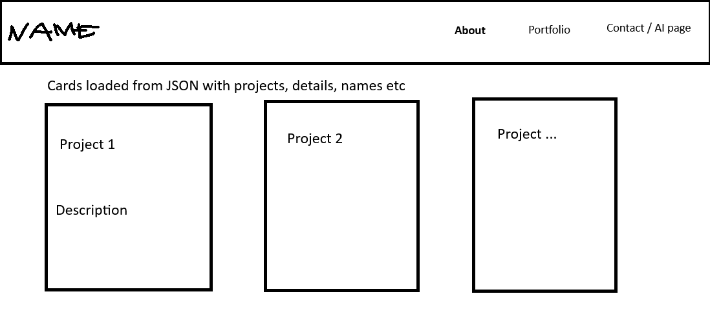
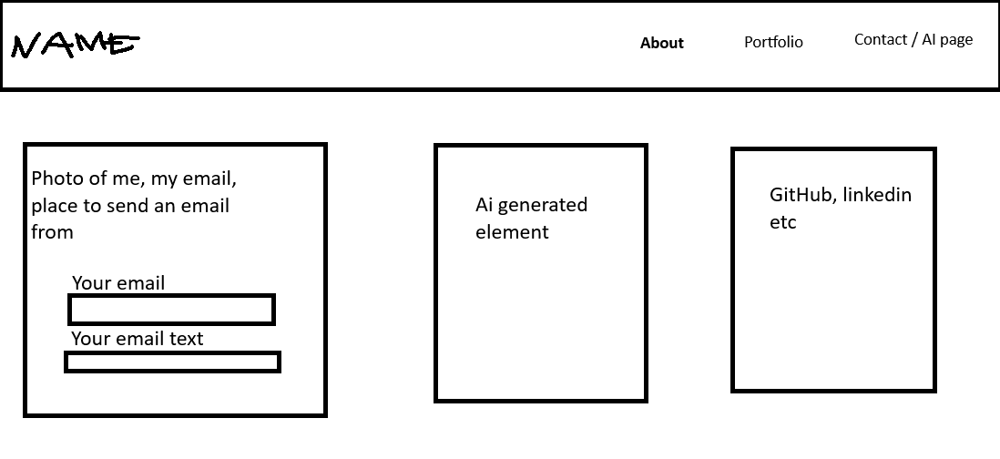

# Design Document

## Project Description

This project is a personal portfolio website developed using vanilla HTML5, CSS3, and ES6+ JavaScript modules. The site serves as a professional homepage that showcases my projects, technical skills, interests, and contact information. 

The website follows a terminal-inspired design aesthetic to differentiate it from traditional portfolio sites and demonstrate frontend development skills. THe homepage features an interactive terminal interface that allows visitors to explore the site in a unique way. The portfolio page dynamically loads project information from a JSON file, and the contact page provides links to social profiles and contact methods.

The project is fully static and deployed publicly using GitHub Pages. It emphasizes responsive design, semantic HTML, accessibility, and modern JavaScript practices without relying on frontend frameworks or component libraries.

---

## User Personas

### Persona 1: Technical Recruiter

A recruiter reviewing software engineering candidates for internships or entry-level roles.

Goals:

- Quickly understand technical skills
- View completed projects
- Access GitHub and LinkedIn profiles
- Evaluate frontend development ability

Background:

- Limited technical depth
- Reviews many portfolios quickly
- Values clean design and professionalism

### Persona 2: Computer Science Student

A fellow student or peer interested in projects, coursework, and programming techniques.

Goals:

- Explore projects and source code
- Learn about technologies used
- Interact with the terminal interface
- View project organization and design choices

Background:

- Familiar with web development concepts
- Interested in implementation details
- Likely browsing on desktop devices

---

## User Stories

### Homepage

- [x] As a visitor, I can view the homepage and understand the site's purpose
- [x] As a visitor, I can navigate to different sections from the navigation bar
- [x] As a visitor, I can interact with a custom terminal interface

### Portfolio Page

- [x] As a visitor, I can browse all projects
- [x] As a visitor, I can view project descriptions and technologies used
- [x] As a visitor, I can open GitHub repositories and live demos

### Contact Page

- [x] As a visitor, I can learn about the site creator
- [x] As a visitor, I can find links to social profiles
- [x] As a visitor, I can contact the creator through listed platforms

---

## Feature List

### Core Features

- [x] Multi-page website structure, 2 created by me, 1 by AI
- [x] Responsive design
- [x] Semantic HTML5 structure
- [x] ES6 module-based JavaScript
- [x] Dynamic project loading from JSON
- [x] Interactive terminal component
- [x] Public GitHub Pages deployment

## Design Goals

- Create a clean and professional portfolio
- Differentiate the site with a terminal-inspired interface
- Maintain fast loading speeds
- Ensure mobile responsiveness
- Use accessible and semantic HTML
- Demonstrate frontend engineering skills without frameworks

---

## Design System

### Color Palette

- Background: `#1a1a1a`
- Secondary Background: `#2b2b2b`
- Accent Color: `#ffd000`
- Primary Text: `#f5f5f5`
- Muted Text: `#b0b0b0`

## Wireframes & Mockups
Home Page/ Index Page

Portfolio Page / Projects Page

Contact Page

